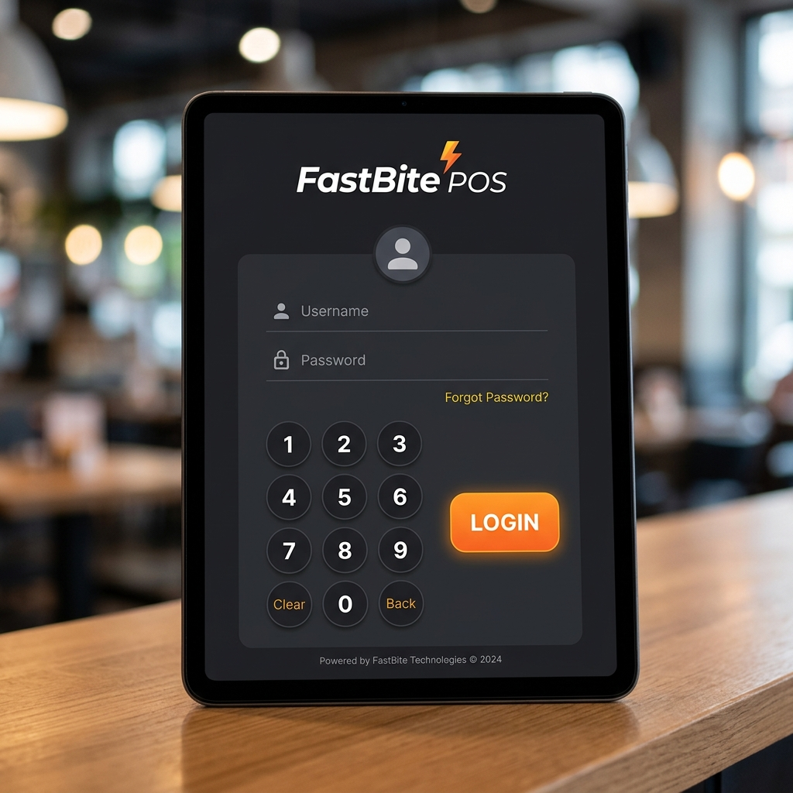
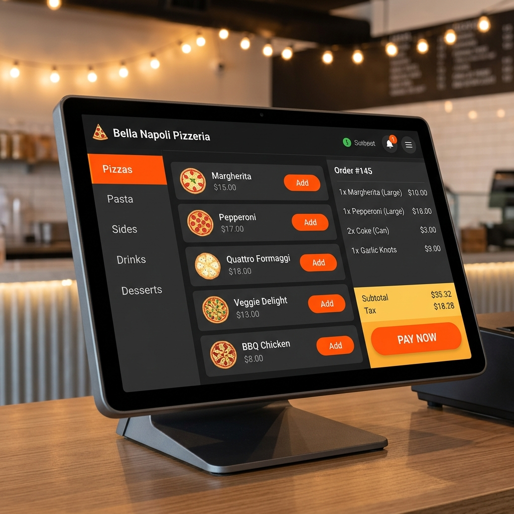
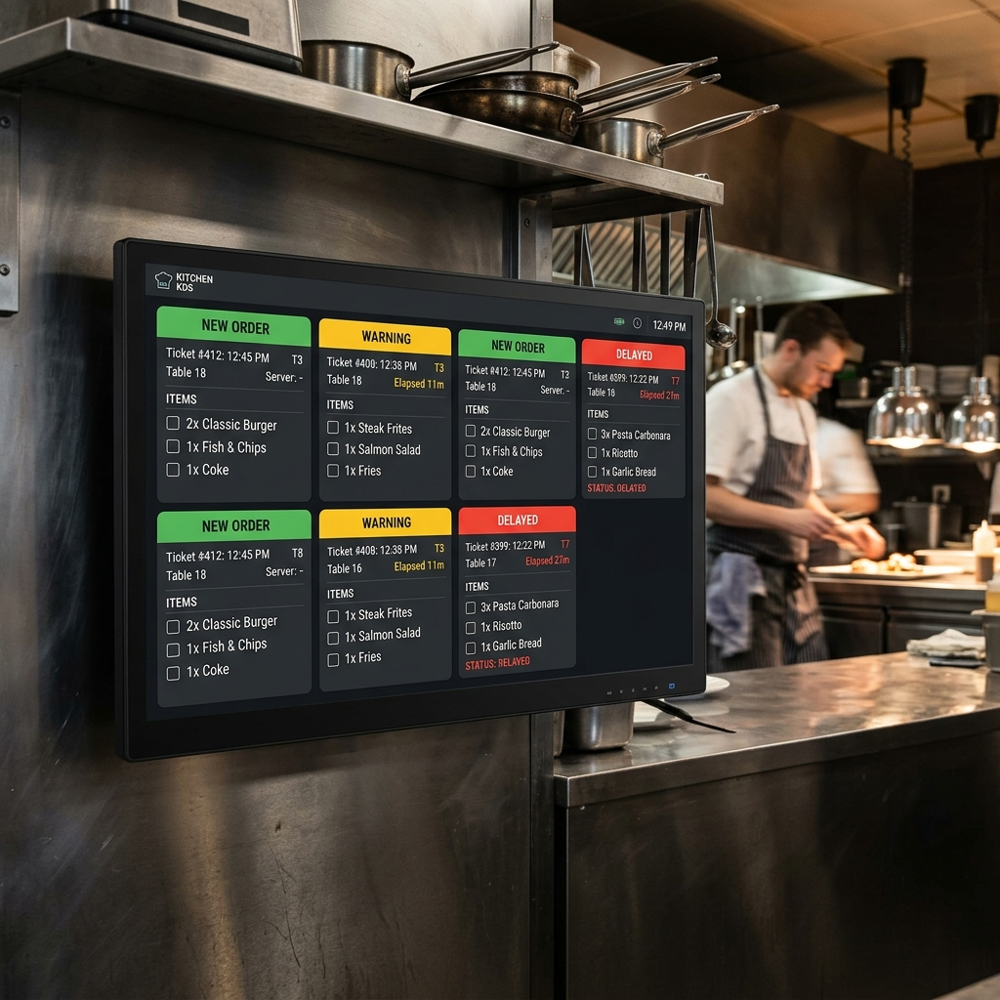
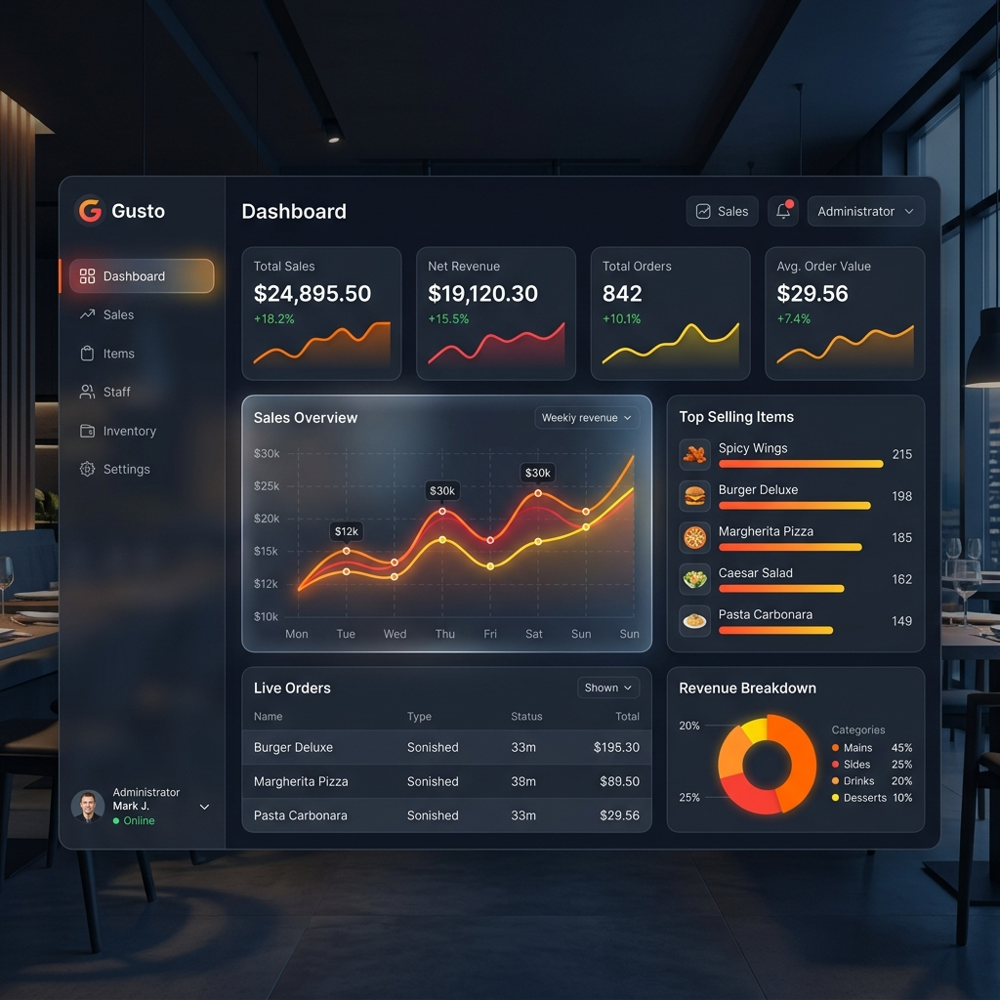

# 🍕 Manual de Usuario — FastBite POS

¡Bienvenido a **FastBite POS** (anteriormente *Pizzas Pastra*)! Este es un sistema integral de Punto de Venta (POS), Gestión de Cocina y Control Contable diseñado para optimizar el flujo de trabajo en restaurantes de comida rápida y pizzerías.

---

## 📑 Tabla de Contenidos

- [1. Introducción y Primeros Pasos](#1-introducción-y-primeros-pasos)
  - [1.1. Asistente de Configuración Inicial (Setup Wizard)](#11-asistente-de-configuración-inicial-setup-wizard)
  - [1.2. Inicio de Sesión y Autenticación](#12-inicio-de-sesión-y-autenticación)
- [2. Guía del Cajero y Operador de Ventas](#2-guía-del-cajero-y-operador-de-ventas)
  - [2.1. Apertura de Caja y Turno](#21-apertura-de-caja-y-turno)
  - [2.2. Toma de Órdenes en el POS](#22-toma-de-órdenes-en-el-pos)
  - [2.3. Personalización: Variantes, Extras y Combos](#23-personalización-variantes-extras-y-combos)
  - [2.4. Proceso de Cobro e Impresión de Tickets](#24-proceso-de-cobro-e-impresión-de-tickets)
  - [2.5. Pedidos a Domicilio (Delivery)](#25-pedidos-a-domicilio-delivery)
  - [2.6. Historial de Órdenes y Reenvió de Recibos](#26-historial-de-órdenes-y-reenvió-de-recibos)
  - [2.7. Registro de Movimientos y Cierre de Caja (Arqueo)](#27-registro-de-movimientos-y-cierre-de-caja-arqueo)
- [3. Guía del Personal de Cocina (KDS) y Repartidores](#3-guía-del-personal-de-cocina-kds-y-repartidores)
  - [3.1. Pantalla de Cocina (Kitchen Display System - KDS)](#31-pantalla-de-cocina-kitchen-display-system---kds)
  - [3.2. Módulo de Despacho y Repartidores](#32-módulo-de-despacho-y-repartidores)
- [4. Guía del Administrador](#4-guía-del-administrador)
  - [4.1. Dashboard Principal](#41-dashboard-principal)
  - [4.2. Gestión del Menú: Categorías, Productos, Variantes y Combos](#42-gestión-del-menú-categorías-productos-variantes-y-combos)
  - [4.3. Administración de Usuarios y Seguridad](#43-administración-de-usuarios-y-seguridad)
  - [4.4. Contabilidad y Auditoría de Arqueos](#44-contabilidad-y-auditoría-de-arqueos)
  - [4.5. Reportes y Métricas de Negocio](#45-reportes-y-métricas-de-negocio)
  - [4.6. Configuración del Sistema e Impresoras](#46-configuración-del-sistema-e-impresoras)
- [5. Preguntas Frecuentes y Solución de Problemas](#5-preguntas-frecuentes-y-solución-de-problemas)

---

## 1. Introducción y Primeros Pasos

### 1.1. Asistente de Configuración Inicial (Setup Wizard)
La primera vez que ejecuta **FastBite POS**, la aplicación abrirá de forma automática el **Asistente de Configuración Inicial**.

1. **Datos de la Empresa**: Ingrese el Nombre del Negocio, RUC/NIT, Dirección, Teléfono y Mensaje de Pie de Página para los tickets.
2. **Cuenta del Administrador**: Defina el nombre de usuario, contraseña y un **PIN de 4 dígitos** para acceso rápido.
3. **Moneda e Impuesto**: Seleccione la moneda de trabajo (ej. `$`, `S/`, `€`) y la tasa de impuesto por defecto (ej. `18%`).
4. **Finalizar**: Al presionar **Guardar y Comenzar**, la base de datos se inicializa y el sistema queda listo para operar.

---

### 1.2. Inicio de Sesión y Autenticación
FastBite POS cuenta con dos modalidades para iniciar sesión:

- **Ingreso por Credenciales**: Nombre de usuario y contraseña completa. Recomendado para administradores.
- **Ingreso por PIN de Acceso Rápido**: El usuario selecciona su nombre en pantalla e ingresa un PIN numérico de 4 dígitos. Diseñado para agilizar la entrada de cajeros y personal operativo durante las horas pico.

Una vez autenticado, el menú lateral izquierdo mostrará las opciones habilitadas de acuerdo al rol asignado (*Administrador*, *Cajero*, *Cocinero*, *Repartidor*).

---

## 2. Guía del Cajero y Operador de Ventas

### 2.1. Apertura de Caja y Turno
Antes de procesar la primera venta del día, el cajero debe aperturar el turno:

1. Diríjase a la sección **Contabilidad / Caja** en el menú lateral.
2. Haga clic en **Abrir Caja**.
3. Ingrese el **Monto Inicial en Efectivo** (fondo de caja para dar cambio).
4. Confirme la apertura. A partir de este momento, el sistema registrará de manera independiente todas las ventas efectuadas durante el turno.

---

### 2.2. Toma de Órdenes en el POS
Para ingresar a la pantalla de ventas, seleccione **Punto de Venta (POS)**.

1. **Selección de Tipo de Pedido**: En la barra superior, elija el tipo de orden:
   - **Para Comer Aquí**: Asigne opcionalmente un número de mesa o identificador.
   - **Para Llevar**: Se emite la orden etiquetada para mostrador.
   - **Domicilio**: Solicitará los datos del cliente (Nombre, Teléfono, Dirección de Envío y Referencia).
2. **Agregar Productos al Carrito**:
   - Navegue por las pestañas de **Categorías** (ej. *Pizzas*, *Bebidas*, *Entradas*, *Combos*).
   - O utilice la **Barra de Búsqueda** superior escribiendo el nombre del producto.
   - Haga clic sobre la tarjeta del producto para añadirlo a la orden activa en el panel derecho.

---

### 2.3. Personalización: Variantes, Extras y Combos

- **Variantes y Adicionales**: Si el producto cuenta con variantes (ej. Pizza Familiar vs Personal, Masa Delgada vs Con Borde de Queso), se desplegará una ventana emergente donde podrá seleccionar el tamaño, sabor y adicionales antes de añadirlo.
- **Notas Especiales**: En el carrito de compra, haga clic en el icono de lápiz sobre un producto para agregar especificaciones a cocina (ej. *"Sin cebolla"*, *"Salsa aparte"*, *"Bien tostada"*).
- **Combos Promocionales**: Al seleccionar un Combo, se abrirá la interfaz de configuración del combo para seleccionar los sabores o bebidas incluidas en la promoción.

---

### 2.4. Proceso de Cobro e Impresión de Tickets
Una vez completados los elementos del pedido:

1. Presione el botón destacado **Pagar / Cobrar**.
2. **Seleccionar Método de Pago**:
   - **Efectivo**: Ingrese el dinero entregado por el cliente. El sistema calculará el **Cambio / Vuelto** a entregar.
   - **Tarjeta**: Marque el tipo de tarjeta (Débito/Crédito) y confirme la transacción del POS electrónico.
   - **Transferencia / Pago Móvil**: Registre el número de referencia del comprobante digital.
   - **Pago Mixto**: Permite combinar métodos (ej. parte en efectivo y parte en tarjeta).
3. **Confirmar Venta**: Al completar el cobro:
   - La orden se enviará automáticamente a la **Pantalla de Cocina (KDS)**.
   - Se enviará la orden a la **Impresora Térmica** conectada emitiendo el ticket cliente y la comanda de cocina.

---

### 2.5. Pedidos a Domicilio (Delivery)
1. En el POS, elija el tipo de pedido **Domicilio**.
2. Complete la ficha del cliente (Nombre, Teléfono, Dirección completa y Notas de reparto).
3. Al procesar el cobro, la orden pasará al módulo **Domicilios / Delivery**.
4. En el panel de **Delivery**, el cajero o despachador podrá:
   - Ver los pedidos pendientes de entrega.
   - Seleccionar y asignar un **Repartidor activo**.
   - Cambiar el estado a **En Camino**.
   - Confirmar cuando el repartidor retorne con el estado **Entregado y Cobrado**.

---

### 2.6. Historial de Órdenes y Reenvió de Recibos
En la sección **Órdenes**:
- Puede buscar pedidos realizados en el día por folio, nombre de cliente o rango de horas.
- Permite **Reimprimir Ticket** si el cliente lo solicita.
- En caso de errores o anulaciones, seleccione la orden y presione **Anular / Cancelar Pedido** (esta acción requiere la autorización mediante PIN de Administrador).

---

### 2.7. Registro de Movimientos y Cierre de Caja (Arqueo)

- **Ingresos / Egresos Manuales**: Si se retira dinero de caja para compras menores (ej. compra urgente de insumos) o se ingresa efectivo adicional, registre el movimiento en **Contabilidad > Registrar Movimiento** detallando el motivo y monto.
- **Arqueo y Cierre de Caja**:
  1. Al finalizar la jornada, vaya a **Contabilidad > Cerrar Caja**.
  2. El sistema solicitará ingresar el conteo físico de billetes y monedas.
  3. Al presionar **Realizar Arqueo**, el sistema comparará el conteo con el sistema contable esperable (Ventas en efectivo + fondo inicial - egresos).
  4. Muestra de forma transparente si la caja está **Cuadrada**, con **Sobrante** o con **Faltante**.
  5. Imprime el reporte de cierre Z y cierra la sesión de caja.

---

## 3. Guía del Personal de Cocina (KDS) y Repartidores

### 3.1. Pantalla de Cocina (Kitchen Display System - KDS)
Diseñada para operarse en pantallas táctiles o monitores en el área de preparación/cocina.

- **Tablero en Tiempo Real**: Cada orden cobrada o enviada a cocina aparece en forma de tarjeta visual.
- **Código de Colores por Antigüedad**:
  - 🟢 **Verde**: Pedido reciente (menos de 10 min).
  - 🟡 **Amarillo**: Pedido en tiempo límite (10 a 20 min).
  - 🔴 **Rojo**: Pedido retrasado (más de 20 min).
- **Detalle Claro**: Muestra el número de folio, tipo de pedido (Mesa, Llevar, Domicilio), cantidad de productos, tamaños, variantes y **notas en texto resaltado** (*ej. SIN CEBOLLA*).
- **Flujo de Trabajo Táctil / Clic**:
  1. Tocar tarjeta ➔ Cambia estado a **En Preparación**.
  2. Tocar nuevamente ➔ Cambia estado a **Listo / Preparado**. La orden emitirá un aviso sonoro/visual y pasará al área de despacho.

---

### 3.2. Módulo de Despacho y Repartidores
Para el personal encargado de armar bolsas y entregar pedidos a repartidores:

- **Lista de Listos**: Muestra los pedidos finalizados por cocina.
- **Asignación de Repartidor**: Seleccione el repartidor asignado de la lista desplegable.
- **Despachar**: Al presionar **Despachar**, la orden sale del panel de cocina y se notifica la salida al repartidor.

---

## 4. Guía del Administrador

### 4.1. Dashboard Principal
El Administrador al iniciar sesión visualizará el **Dashboard de Control**:

- Total de Ventas del Día.
- Número de Órdenes Procesadas.
- Promedio de Ticket de Venta.
- Gráficos de tendencias de ventas por hora y productos estrella.

---

### 4.2. Gestión del Menú: Categorías, Productos, Variantes y Combos
Acceda a **Gestión de Menú** en la barra lateral.

- **Categorías**: Permite crear, modificar o eliminar categorías (ej. *Pizzas Tradicionales*, *Pizzas Gourmet*, *Bebidas*, *Postres*, *Promociones*).
- **Productos**:
  - **Alta/Edición**: Ingrese Nombre, Descripción, Precio base, Categoría e Imagen representativa.
  - **Disponibilidad**: Marque la casilla *Activo* o *Agotado* para habilitar o deshabilitar temporalmente un producto del POS.
- **Variantes y Modificadores**:
  - Defina grupos de opciones (ej. *Tamaño*, *Tipo de Masa*, *Ingredientes Extra*).
  - Asigne variaciones de precio por opción (ej. Tamaño Familiar `+$5.00`).
- **Combos**:
  - Configure paquetes promocionales que agrupen productos con descuento (ej. *Combo Pareja = 1 Pizza Mediana + 2 Bebidas + 1 Garlic Bread*).

---

### 4.3. Administración de Usuarios y Seguridad
En el módulo **Usuarios**:

1. **Crear Nuevo Usuario**: Complete Nombre, Usuario, Contraseña y PIN de 4 dígitos.
2. **Asignación de Rol**:
   - **Administrador**: Acceso ilimitado a configuraciones, reportes, usuarios y cancelaciones.
   - **Cajero**: Acceso al POS, caja, domicilios e historial de ventas.
   - **Cocinero**: Acceso exclusivo a la Pantalla de Cocina (KDS).
   - **Repartidor**: Acceso a la vista de despachos/entregas asignadas.
3. **Seguridad**: Permite restablecer contraseñas o PINs olvidados en cualquier momento.

---

### 4.4. Contabilidad y Auditoría de Arqueos
En la sección **Contabilidad**:
- Historial completo de cierres de caja por fecha y por cajero.
- Detalle de descuadres registrados (faltantes/sobrantes).
- Desglose de ingresos por método de pago (Efectivo vs Tarjeta vs Transferencia).

---

### 4.5. Reportes y Métricas de Negocio
En el módulo **Reportes**:
- **Filtros por Fecha**: Consulte información diaria, semanal, mensual o por rangos personalizados.
- **Productos más Vendidos (Top Selling)**: Ranking de artículos con mayor demanda e ingresos generados.
- **Ventas por Horas**: Identifique horas pico para optimizar turnos de personal.
- **Exportación**: Posibilidad de visualizar gráficos interactivos y consultar datos claves para la toma de decisiones.

---

### 4.6. Configuración del Sistema e Impresoras
Acceda a **Ajustes**:

- **Datos de la Empresa**: Configure Nombre del Negocio, RUC/NIT, Dirección, Teléfono y Mensaje de Bienvenida/Agradecimiento en tickets.
- **Configuración de Impresora Térmica**:
  - **Tipo de Conexión**: Impresión local en Windows (`win32print`) o comandos directos ESC/POS.
  - **Nombre de Impresora**: Seleccione la impresora térmica instalada en el sistema.
  - **Ancho del Papel**: 58mm o 80mm.
  - **Impresión de prueba**: Botón para probar la emisión de ticket de verificación.
- **Apariencia**: Cambie entre Tema Oscuro (Dark Mode) y Tema Claro (Light Mode) según la preferencia del establecimiento.
- **Copia de Seguridad (Backup)**: Botón para realizar copia de respaldo del archivo de base de datos `pizzas_pastra.db` a una memoria USB o disco externo.

---

## 5. Preguntas Frecuentes y Solución de Problemas

### ❓ La impresora térmica no emite el ticket
1. Verifique que la impresora esté encendida, con papel y conectada vía USB a la computadora.
2. Diríjase a **Ajustes > Impresora** y presione el botón **Probar Impresión**.
3. Asegúrese de que la impresora seleccionada en la lista sea la correcta y que el ancho de papel (58mm u 80mm) esté configurado adecuadamente.

### ❓ Un cajero olvidó su PIN de 4 dígitos
1. Inicie sesión con una cuenta con rol de **Administrador**.
2. Vaya a **Usuarios**, edite el usuario del cajero y asigne un nuevo PIN.

### ❓ ¿Qué hacer si hay un fallo de energía durante el turno?
1. Al reiniciar la computadora y abrir FastBite POS, el turno de caja permanecerá abierto con todas las ventas registradas hasta antes del corte.
2. Las órdenes en cocina que estaban en estado *Pendiente* o *En Preparación* continuarán almacenadas en la base de datos sin pérdida de información.

### ❓ ¿Cómo anular una orden ingresada por error?
1. Vaya al módulo **Órdenes**.
2. Localice la orden en la lista y presione **Anular**.
3. Ingrese la contraseña o PIN de **Administrador** para confirmar la anulación. El sistema devolverá el dinero a caja si fue cobrada.

---

*FastBite POS — Copyright (c) 2026 Alexis Corpas Romero / CORJAR Computers. Licencia GNU AGPLv3.*
